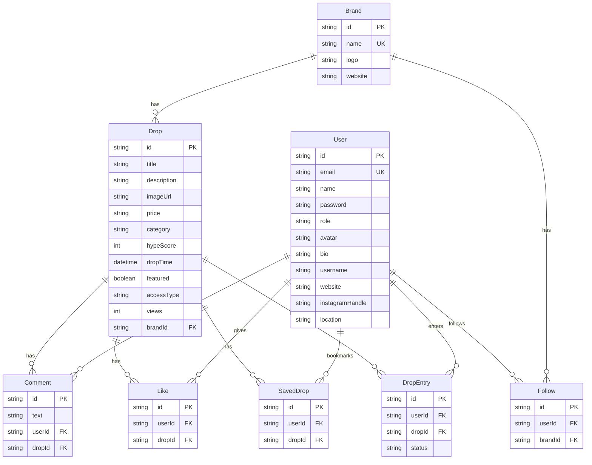

# Dropamyn (Dropout) — Project Outline

## 1. Overview

**Dropamyn** is a social-discovery platform for upcoming product launches and brand drops — think "Instagram meets Product Hunt" for consumer products. Users scroll through a curated feed to discover upcoming drops across **sneakers, tech, streetwear, gaming, AI tools, creator merch, and limited-edition collaborations**.

| Attribute | Detail |
|---|---|
| Project name | `dropamyn` (repo: `Dropout-main`) |
| Version | `0.1.0` (MVP) |
| License | MIT |
| Deployed frontend | `https://dropout-eta.vercel.app` / `https://dropamyn.com` |
| Deployed backend | `https://dropout-htf0.onrender.com` |

---

## 2. Tech Stack

### Frontend
| Technology | Version | Role |
|---|---|---|
| **Next.js** | 16.1.6 | Framework (App Router) |
| **React** | 19.2.3 | UI library |
| **TailwindCSS** | 4.x | Styling (via PostCSS) |
| **Fonts** | Sora, Space Grotesk, Allura | Typography (Google Fonts) |

### Backend
| Technology | Version | Role |
|---|---|---|
| **Express** | 5.0.1 | HTTP server |
| **Prisma** | 6.4.1 | ORM / database toolkit |
| **PostgreSQL** | — | Database (via `DATABASE_URL`) |
| **bcryptjs** | 3.0.3 | Password hashing |
| **jsonwebtoken** | 9.0.3 | JWT authentication |
| **Cloudinary** | 2.5.1 | Image uploads |
| **Multer** | 1.4.5 | Multipart file upload middleware |

---

## 3. Project Structure

```
Dropout-main/
├── app/                          # Next.js App Router pages
│   ├── layout.js                 # Root layout (fonts, ClientShell wrapper)
│   ├── page.js                   # Landing page (hero, mosaic, typewriter)
│   ├── globals.css               # Full design system (~40 KB)
│   ├── feed/page.js              # Main feed (scrollable drop cards)
│   ├── trending/page.js          # Trending drops (sorted by hype score)
│   ├── search/page.js            # Search / discover drops
│   ├── calendar/page.js          # Drop calendar (timeline by date)
│   ├── categories/page.js        # Category browser
│   ├── saved/page.js             # Saved/bookmarked drops
│   ├── login/page.js             # Authentication (login & signup)
│   ├── profile/page.js           # User profile + settings
│   ├── dashboard/page.js         # Brand dashboard (analytics, create drops)
│   ├── drop/[id]/page.js         # Individual drop detail + comments
│   └── brand/[id]/page.js        # Brand public profile page
│
├── components/                   # Reusable React components
│   ├── ClientShell.js            # Client-side wrapper (Suspense boundary)
│   ├── Navbar.js                 # Sidebar (desktop) + bottom nav (mobile)
│   ├── DropCard.js               # Instagram-style drop card
│   ├── CountdownTimer.js         # Live countdown to drop time
│   ├── HypeScore.js              # Hype score meter/badge
│   ├── FluidCanvas.js            # Ambient canvas animation
│   └── LiquidGlass.js            # Glassmorphism SVG filter + panel layers
│
├── lib/                          # Client-side libraries
│   ├── api.js                    # API client (all REST calls)
│   ├── drops.js                  # Mock data (16 drops) + utility functions
│   ├── notifications.js          # Local notification system (localStorage)
│   ├── userStorage.js            # User session management (localStorage)
│   └── dropStatus.js             # Drop status logic (upcoming/live/ended)
│
├── server/                       # Backend Express API
│   ├── package.json              # Server dependencies
│   ├── prisma/
│   │   ├── schema.prisma         # Database schema (6 models)
│   │   ├── seed.js               # Seed data script
│   │   └── migrations/           # Prisma migrations
│   └── src/
│       ├── index.js              # Express entry point
│       ├── routes/
│       │   ├── auth.js           # /api/auth/* (login, signup, me)
│       │   ├── drops.js          # /api/drops/* (CRUD, like, comment, view)
│       │   ├── brands.js         # /api/brands/* (list, detail, follow)
│       │   ├── users.js          # /api/users/* (profile, save, settings)
│       │   └── upload.js         # /api/upload (image upload to Cloudinary)
│       ├── middleware/
│       │   └── auth.js           # JWT authentication middleware
│       └── utils/
│           └── hypeScore.js      # Hype score calculation algorithm
│
├── public/                       # Static assets (SVGs)
├── package.json                  # Frontend dependencies
├── next.config.mjs               # Remote image patterns
├── postcss.config.mjs            # PostCSS → TailwindCSS
└── eslint.config.mjs             # ESLint config
```

---

## 4. Database Schema (Prisma)

6 models connected via foreign keys, using PostgreSQL:



> [!NOTE]
> `SavedDrop`, `Like`, `Follow`, and `DropEntry` all use `@@unique([userId, dropId/brandId])` for one-action-per-user constraints.

---

## 5. Frontend Pages — Detail

### Landing Page (`/`)
- **Mosaic background** — 4 columns of product images auto-scrolling at different speeds
- **Typewriter effect** — rotating hero taglines
- **Cursor aura** — ambient glow following mouse (desktop)
- **Ambient layers** — gradient glow, film grain, vignette
- **CTAs** — "Explore Drops →" (unauthenticated) or "My Feed →" (logged in)

### Feed (`/feed`)
- Instagram-style scrollable feed of `DropCard` components
- Category filtering via query params (`?category=sneakers`)
- Fetches from backend API (`/api/drops`)
- Infinite-scroll-ready layout

### Trending (`/trending`)
- Drops sorted by **hype score** (descending)
- Fetches from `/api/drops/trending`

### Search (`/search`)
- Search and discover drops with filtering

### Calendar (`/calendar`)
- Timeline view grouping drops by date
- Uses `getUpcomingDates()` utility

### Categories (`/categories`)
- Grid of 7 categories: Sneakers, Tech, Streetwear, Gaming, AI Tools, Creator Merch, Limited Edition

### Saved (`/saved`)
- Bookmarked drops for the logged-in user
- Fetches from `/api/users/:id/saved`

### Drop Detail (`/drop/[id]`)
- Full drop info, comments section
- Engagement actions (like, save, comment, share, notify)
- Raffle/waitlist entry

### Brand Profile (`/brand/[id]`)
- Brand page showing all drops from a brand
- Follow/unfollow functionality

### Dashboard (`/dashboard`)
- **Brand-only** — visible only to `role: "brand"` users
- Create new drops, view analytics

### Login (`/login`)
- Email + password authentication
- Signup with role selection (user/brand)

### Profile (`/profile`)
- User profile info, avatar, bio, social links
- Edit profile functionality

---

## 6. Key Components

| Component | Size | Description |
|---|---|---|
| [Navbar.js](file:///c:/Users/gshub/OneDrive/Desktop/platform/Dropout-main/components/Navbar.js) | 586 lines | **Desktop**: collapsible left sidebar (72px→240px on hover). **Mobile**: fixed top header + bottom tab bar. Categories sub-menu, notification panel, user avatar. |
| [DropCard.js](file:///c:/Users/gshub/OneDrive/Desktop/platform/Dropout-main/components/DropCard.js) | 314 lines | Instagram-style card: brand header → product image with countdown overlay → action bar (upvote, comment, share, bookmark) → stats → title/description → price + shop link. Uses IntersectionObserver for scroll-triggered animations. |
| [CountdownTimer.js](file:///c:/Users/gshub/OneDrive/Desktop/platform/Dropout-main/components/CountdownTimer.js) | — | Real-time countdown to `dropTime`, shows "Live Now" or "Ended". |
| [LiquidGlass.js](file:///c:/Users/gshub/OneDrive/Desktop/platform/Dropout-main/components/LiquidGlass.js) | — | SVG filter definitions for glassmorphism + reusable glass panel layer overlay. |
| [HypeScore.js](file:///c:/Users/gshub/OneDrive/Desktop/platform/Dropout-main/components/HypeScore.js) | — | Visual hype-score meter (0–100). |

---

## 7. Backend API Routes

### Auth (`/api/auth`)
| Method | Endpoint | Description |
|---|---|---|
| POST | `/login` | Email/password login → returns JWT + user |
| POST | `/signup` | Create account (user or brand role) |
| GET | `/me` | Get current user from JWT |

### Drops (`/api/drops`)
| Method | Endpoint | Description |
|---|---|---|
| GET | `/` | List all drops (optional `?category=`) |
| GET | `/trending` | Top drops by hype score |
| GET | `/:id` | Single drop detail |
| PUT | `/:id/like` | Toggle upvote |
| PUT | `/:id/unlike` | Remove upvote |
| POST | `/:id/comments` | Add comment |
| PUT | `/:id/view` | Increment view count |
| POST | `/:id/enter` | Enter raffle/waitlist |

### Brands (`/api/brands`)
| Method | Endpoint | Description |
|---|---|---|
| GET | `/` | List all brands |
| GET | `/:id` | Brand detail |
| PUT | `/:id/follow` | Toggle follow brand |
| GET | `/:id/analytics` | Brand analytics (dashboard) |

### Users (`/api/users`)
| Method | Endpoint | Description |
|---|---|---|
| GET | `/:id` | User profile |
| PUT | `/:id` | Update profile |
| PUT | `/:id/save/:dropId` | Toggle save/bookmark drop |
| GET | `/:id/saved` | List saved drops |

### Upload (`/api/upload`)
| Method | Endpoint | Description |
|---|---|---|
| POST | `/` | Upload image → Cloudinary |

---

## 8. Client-Side Libraries

### [api.js](file:///c:/Users/gshub/OneDrive/Desktop/platform/Dropout-main/lib/api.js)
REST client wrapping `fetch()` with:
- Automatic JWT token injection from `localStorage`
- Error handling with JSON fallback
- `transformDrop()` function to normalize backend → frontend data shape
- Server-side fetch variant for SSR (no auth headers)

### [notifications.js](file:///c:/Users/gshub/OneDrive/Desktop/platform/Dropout-main/lib/notifications.js)
Client-side notification system using `localStorage`:
- Toggle drop reminders (subscribe/unsubscribe)
- Auto-fire browser `Notification` when drop time arrives
- `processDueNotifications()` runs on 30-second interval
- Read/unread tracking

### [userStorage.js](file:///c:/Users/gshub/OneDrive/Desktop/platform/Dropout-main/lib/userStorage.js)
Reactive user session management:
- Uses `useSyncExternalStore` pattern for React 18+ concurrent-safe reads
- Custom event (`dropout-user-changed`) for cross-component sync
- Session restoration from JWT on page load

### [dropStatus.js](file:///c:/Users/gshub/OneDrive/Desktop/platform/Dropout-main/lib/dropStatus.js)
Drop lifecycle status:
- `upcoming` → `live` (24h window after drop time) → `ended`
- Filter drops by lifecycle tab

### [drops.js](file:///c:/Users/gshub/OneDrive/Desktop/platform/Dropout-main/lib/drops.js)
16 mock drops with brands (Nike, Apple, MrBeast, Sony, Jordan, Supreme, NVIDIA, Epic Games, OpenAI, Tesla, Yeezy, Figma, Xbox, Palace, Google, PRIME) + utility functions for filtering and sorting.

---

## 9. Design System

- **Theme**: Premium dark mode with blue accent (`#3b82f6`)
- **Glassmorphism**: SVG `feTurbulence` + `feDisplacementMap` filters, `backdrop-filter: blur()`
- **Typography**: Sora (headings), Space Grotesk (body), Allura (decorative)
- **Animations**: Typewriter, cursor aura glow, scroll-triggered fade-in, hover scale, countdown blink
- **Responsive**: Desktop sidebar + mobile bottom tab bar
- **CSS**: ~40KB `globals.css` design system with CSS variables

---

## 10. Deployment

| Layer | Platform | URL |
|---|---|---|
| Frontend | **Vercel** | `dropout-eta.vercel.app` / `dropamyn.com` |
| Backend | **Render** | `dropout-htf0.onrender.com` |
| Database | **PostgreSQL** | Via `DATABASE_URL` env var |
| Images | **Cloudinary** | Upload API |

### CORS Origins
```
https://dropout-eta.vercel.app
https://dropamyn.com
https://www.dropamyn.com
http://localhost:3000
```

---

## 11. Roadmap (Planned)

- [ ] Google OAuth authentication
- [ ] Image upload for user-created drops
- [ ] Push notifications (service worker)
- [ ] AI-powered drop recommendations
- [ ] Affiliate links & monetization
- [ ] Mobile app (React Native)

---

## 12. Running Locally

```bash
# Frontend
cd Dropout-main
npm install
npm run dev           # → http://localhost:3000

# Backend (separate terminal)
cd Dropout-main/server
npm install
npx prisma generate
npx prisma db push    # requires DATABASE_URL in .env
npm run dev           # → http://localhost:3001
npm run db:seed       # seed database with mock data
```

> [!IMPORTANT]
> The server requires a `.env` file with `DATABASE_URL`, `JWT_SECRET`, and optionally `CLOUDINARY_*` credentials.
